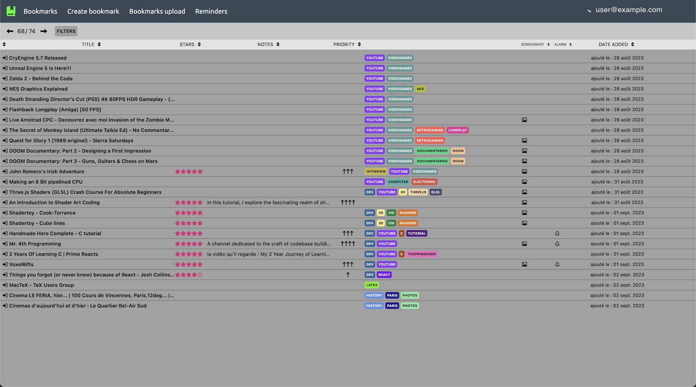
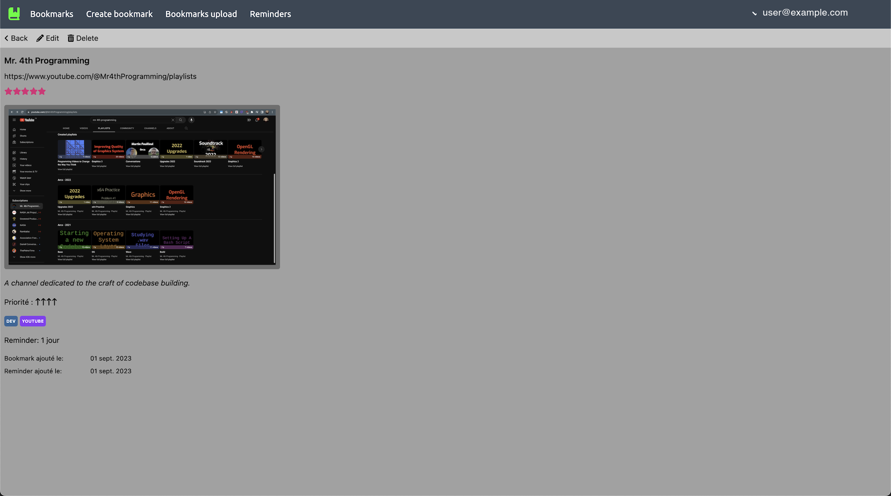
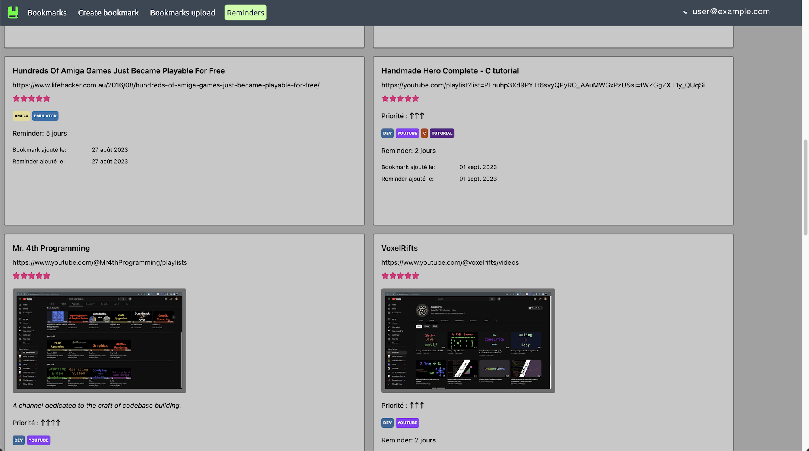

# bkmk-next

### backend :
- NodeJS/Express
- MySQL

### frontend :
- NextJS v13
- React Hook Form
- Tanstack Query
- Zustand


### Demo data

The house dev account, `local.dev@mock.io`, is filled with an invented index by the seeder — which
lives on the API side, not the front:

```bash
cd backend && pnpm seed -- --wipe
```

`backend/docs/seeding.md` says what it writes, why it is run on the day of a take, and how to reset
the account. The credentials, and the pointers to the secret files, are in `ACCOUNTS.md` at the repo
root — untracked, one per machine.







